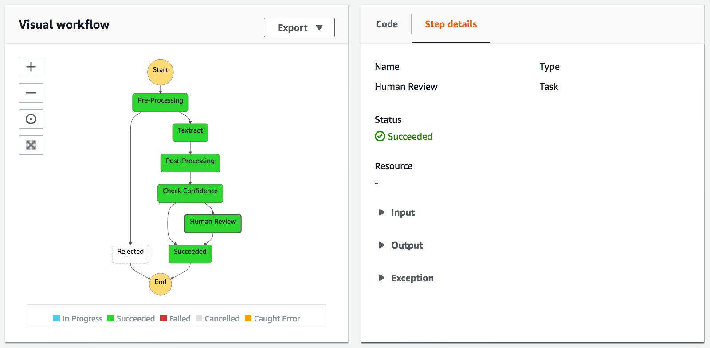

# End-to-End Smart OCR

[Amazon Textract's](https://aws.amazon.com/textract/) advanced extraction features go beyond simple OCR to recover structure from documents: Including tables, key-value pairs (like on forms), and other tricky use-cases like multi-column text.

**However, many practical applications need to combine this technology with use-case-specific logic** - such as:

- Pre-checking that submitted images are high-quality and of the expected document type
- Post-processing structured text results into business-process-level fields (e.g. in one domain "Amount", "Total Amount" and "Amount Payable" may be different raw annotations for the same thing; whereas in another the differences might be important!)
- Human review and re-training flows

This solution demonstrates how Textract can be integrated with:

- **Image pre-processing logic** - using [Amazon Rekognition Custom Labels](https://aws.amazon.com/rekognition/custom-labels-features/) to create a high-quality custom computer vision with no ML expertise required
- **Results post-processing logic** - using custom logic as well as NLP from [Amazon Comprehend](https://aws.amazon.com/comprehend/)
- **Human review and data annotation** - using [Amazon A2I](https://aws.amazon.com/augmented-ai/) and [Amazon SageMaker Ground Truth](https://aws.amazon.com/sagemaker/groundtruth/)

...on a simple example use-case: **extracting vendor, date, and total amount from receipt images.**

The design is modular, to show how this pre- and post-processing can be easily customized for different applications.


## Solution Architecture Overview

This overview diagram is *not an exhaustive list* of AWS services used in the solution.


The solution **orchestrates the core OCR pipeline** with [AWS Step Functions](https://aws.amazon.com/step-functions/) - rather than direct point-to-point integrations - which gives us a customizable, graphically-visualizable flow (defined in [/source/StateMachine.asl.json](source/StateMachine.asl.json)):



The **client application** and associated services are built and deployed as an [AWS Amplify](https://aws.amazon.com/amplify/) app, which simplifies setup of standard client-cloud integration patterns (e.g. user sign-up/login, authenticated S3 data upload).

Rather than have our web client *poll* the state machine for progress updates, we **push messages** via [Amplify PubSub](https://docs.amplify.aws/lib/pubsub/getting-started/q/platform/js) - powered by [AWS IoT Core](https://aws.amazon.com/iot-core/).

The [Amplify build settings](https://docs.aws.amazon.com/amplify/latest/userguide/build-settings.html) (in [amplify.yml](amplify.yml) with some help from the [Makefile](Makefile)) define how **both** the Amplify-native and custom stack components are built and deployed... Leaving us with the folder structure you see in this repository:

```tree
├── amplify                   [Auto-generated, Amplify-native service config]
├── source
│   ├── ocr                       [Custom, non-Amplify backend service stack]
│   │   ├── human-review              [Human review integration with Amazon A2I]
│   │   ├── postprocessing            [Extract business-level fields from Textract output]
│   │   ├── preprocessing             [Image pre-check/cleanup logic]
│   │   ├── textract-integration      [SFn-Textract integrations]
│   │   ├── ui-notifications          [SFn-IoT push notifications components]
│   │   ├── StateMachine.asl.json     [Processing flow definition]
│   │   └── template.sam.yml          [AWS SAM template for non-Amplify components]
│   └── webui                     [Front-end app (VueJS, BootstrapVue, Amplify)]
├── amplify.yml               [Overall solution build steps]
└── Makefile                  [Detailed build commands, to simplify amplify.yml]
```

|`NOTE` | For details on each component, check the READMEs in their subfolders! |
|-|-|


## Deploying the Solution

If you have:

- A [GitHub Account](https://github.com/join)
- An [AWS Account](https://aws.amazon.com/account/)
- **Understood that this solution may consume services outside the [Free Tier](https://aws.amazon.com/free), which will be chargeablee**

...then you can go ahead and click the button below, which will fork the repository and deploy the base solution stack(s):

[](https://console.aws.amazon.com/amplify/home#/deploy?repo=https://github.com/athewsey/textract-demo)

From here, there are just a few extra (but not trivial) **manual configuration steps** required to complete your setup:

- Create a [Rekognition Custom Labels](https://console.aws.amazon.com/rekognition/custom-labels) model [as described in the preprocessing component doc](source/ocr/preprocessing), and configure your `FunctionPreProcess` Lambda function's environment variable to reference it.
- Create an [Amazon A2I](https://docs.aws.amazon.com/sagemaker/latest/dg/a2i-use-augmented-ai-a2i-human-review-loops.html) human review flow and workforce [as described in the human-review component doc](source/ocr/human-review), and configure your `FunctionStartHumanReview` Lambda function's environment variable to reference the flow.
- Register a user account **through the deployed app UI**, log in, and check it's permissions are set up correctly [as described in the ui-notifications component doc](source/ocr/ui-notifications).

Now you should be all set to upload images through the app UI, review low-confidence results through the Amazon A2I UI, and see the results!
