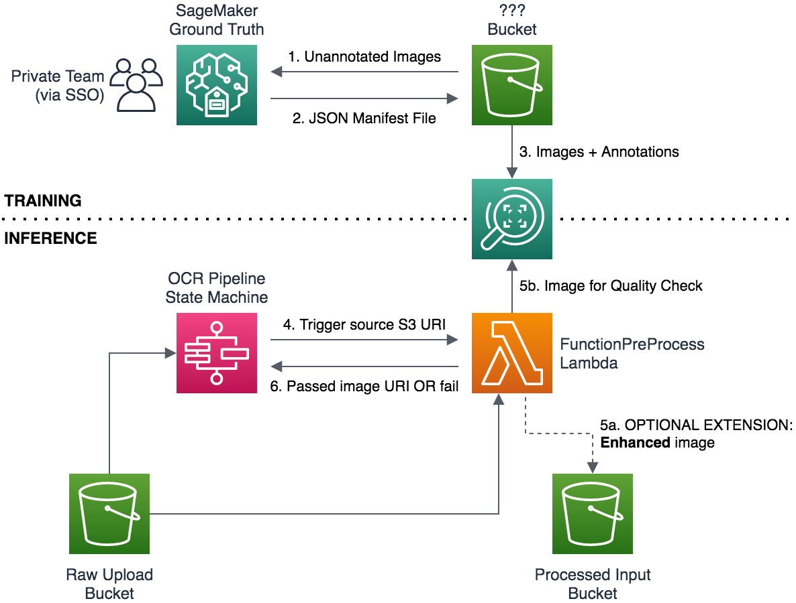
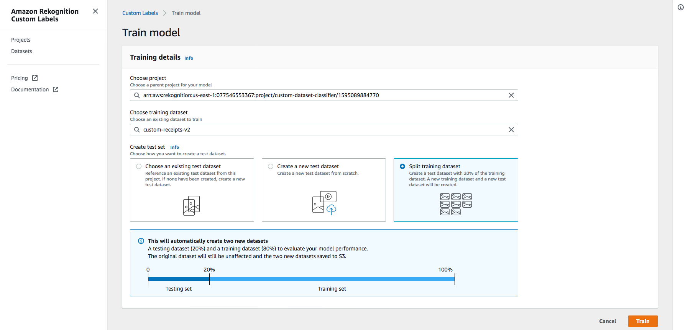

# Image Pre-Processing

Before sending the source images to Textract, we may wish to:

1. **Validate** their quality (or else reject early in the pipeline) or otherwise **classify** the type of document being received
2. **Enhance** the image for OCR to mitigate minor quality issues
3. **Extract** particular regions of interest, to remove other noise

In this example we demonstrate (1) with a small example dataset, and show some architectural tips for (2) and (3).


## Component Architecture

With [Amazon Rekognition Custom Labels](https://aws.amazon.com/rekognition/custom-labels-features/), we can train and deploy an image classification model (for validation or classification) or bounding-box object detection model (could be useful for region-of-interest extraction) - with no ML experience required: Just labelled data.

For basic image processing techniques (for enhancement), it may be sufficient to install [OpenCV](https://opencv.org/) directly in our AWS Lambda runtime and process the image there.

In our toy example the annotation is **simple** (classification, rather than bounding box), **small** (very few samples), and **already done** (images sorted into folders): But we'll show how you can take advantage of [Amazon SageMaker Ground Truth](https://aws.amazon.com/sagemaker/groundtruth/) to accelerate real-world data labelling tasks.

To maintain flexibility on whether the component simply **validates** images or in some way **modifies** them, we have our processing function return a **(potentially changed) S3 URI** - rather than just a label.

The resulting architecture is as shown below:

<br> 


## Post-Deployment Setup

To set up this module after deploying the solution, you'll need to:

1. [**Fetch**](#1.-Fetch-the-Data) the training data (or bring your own!) into your environment
1. [**(Optionally) Label**](#2.-(Optionally)-Label-the-data) the images as "good" or "bad"
2. [**Train**](#3.-Train-the-Model) a Rekognition Custom Labels solution
3. [**Deploy**](#4.-Deploy-and-Integrate) the model: connecting it to the demo solution stack

### 1. Fetch the Data

**Locate your training data bucket:**

- From the [S3 Console](https://s3.console.aws.amazon.com/s3/home), find the `PreprocessTrainingBucket` created for you by the CloudFormation stack: Its name should include this phrase, but will have some auto-generated prefix and suffix from CloudFormation/Amplify.
- If you're not able to find the bucket in S3, go to your [CloudFormation Stack](https://console.aws.amazon.com/cloudformation/home#/stacks) and search in the *"Resources"* tab.
- If you created the stack via AWS Amplify and don't know your CloudFormation Stack Name, it will be something like `amplify-{AppName}-{BranchName}-{RandomNumber}-processing-{BranchName}`

**Download the sample data:**

Download the sample (approx 100MB) `receipts.zip` from whichever of our S3 hosts is most convenient for your region:

| Region | URL |
|:------ |:--- |
| US East (N. Virginia) | https://public-asean-textract-demo-us-east-1.s3.amazonaws.com/receipts.zip |
| Asia Pacific (Singapore) | https://public-asean-textract-demo-ap-southeast-1.s3-ap-southeast-1.amazonaws.com/receipts.zip |

**Load the data into your bucket**

You can simply **extract** `receipts.zip` on your local computer and then drag & drop the resulting `good/` and `bad/` folders into your `PreprocessTrainingBucket` via the [S3 Console](https://s3.console.aws.amazon.com/s3/home).


### 2. (Optionally) Label the Data

Since we have a toy, pre-labelled dataset for you, it's possible to skip SageMaker Ground Truth and import the S3 dataset directly to Rekognition Custom Labels.

**To annotate the images in SageMaker Ground Truth:**

- Follow the instructions in [groundtruth-labelling](groundtruth-labelling/README.md) to annotate your images.
- Open the [Amazon Rekognition Custom Labels Console](https://console.aws.amazon.com/rekognition/custom-labels) and navigate to **Datasets** from the left sidebar (which might be collapsed at first, if you're new to the service).
- Click **Create dataset** and select the option to *Import images labelled by Amazon SageMaker Ground Truth*. You'll need to give the location of your **output manifest file** as created by the completed labelling job.

You shouldn't need to do any additional S3 bucket permissions configuration (if prompted), because this is set up by the CloudFormation stack. The dataset creation should look something like this:

 Screenshot")

**To skip data annotation and import directly:**

- Open the [Amazon Rekognition Custom Labels Console](https://console.aws.amazon.com/rekognition/custom-labels) and navigate to **Datasets** from the left sidebar (which might be collapsed at first, if you're new to the service).
- Click **Create dataset** and select the option to *Import images from an Amazon S3 bucket*. You'll need to give the location of your **output manifest file** as created by the completed labelling job.
- Provide the S3 location where your `good` and `bad` folders are uploaded.
- **Enable automatic labelling** so your images will be automatically classified from their folder name.

 Screenshot")

Whichever method you chose, you should now see a dataset in the [Rekognition Custom Labels Console 'Datasets' list](https://console.aws.amazon.com/rekognition/custom-labels#/datasets).

### 3. Train the Model

- Go to the [Projects List](https://console.aws.amazon.com/rekognition/custom-labels#/projects) of the Amazon Rekognition Custom Labels Console and click **Create project**: Select a name that works for your context, e.g. `demo-receipts-classifier`.
- Either from the main page or after clicking on the project, click **"Train new model"**.
- The correct *Project ARN* should have pre-populated for you - otherwise you can select a different project by name using the drop-down.
- In **Choose training dataset**, select the Custom Labels dataset we just created above
- In **Create test set**, you can either:
  - Apply good ML practice by selecting *"Split training dataset"* (since we don't have a separate test set defined in our example), or
  - Maximise performance on the (tiny) provided dataset by selecting *"Choose an existing test dataset"* and picking the same dataset again. In this case the model performance metrics won't be very meaningful, but our dataset is so small we know generalization won't be amazing anyway!



Start the training process, and refresh the console periodically to check on the status of the job. 

Start the training process, and then you'll need to wait until the training completes. When the model reaches `TRAINING_COMPLETED` status, it's ready to deploy. If you selected to use the same dataset for training and test, you'll likely see a reported [F1 score](https://en.wikipedia.org/wiki/F1_score) of `1.000` - but if you chose to split the dataset you may see a significantly lower (and more representative!) figure.


### 3. Deploy and Integrate

Once your model has finished training, click on its name to view its full details page and copy the **model ARN**, which should have a format something like:

```
arn:aws:rekognition:us-east-1:123456789012:project/receipt-classification/version/receipt-classification.2020-08-03T15.57.13/1596441361045
```

Next, in the [AWS Lambda Console](https://console.aws.amazon.com/lambda/), find your deployed `FunctionPreProcess` function.

In the Lambda function **Configuration** page, set the `REKOGNITION_MODEL_ARN` **environment variable** to your model ARN.

Your workflow should now be connected and ready to use the model for incoming requests!

Because (at the time of writing) there is no UI button to start (deploy) and stop (de-provision) a Rekognition Custom Labels model, we've set the Lambda function up to request the model to start if it isn't in the `RUNNING` state.

- This means the first invokation will fail, but kick off the deployment
- Any subsequent invokations while the model is still `STARTING` will also return an error
- ...But once the model is `RUNNING` it should work fine!

> ⚠️ **Note:** you're charged by provisioned capacity for the time that a Rekognition Custom Labels model is deployed, regardless of whether any requests are received.
>
> To clean up resources when you're done experimenting, you can use the `aws rekognition stop-project-version` [AWS CLI](https://aws.amazon.com/cli/) command.
