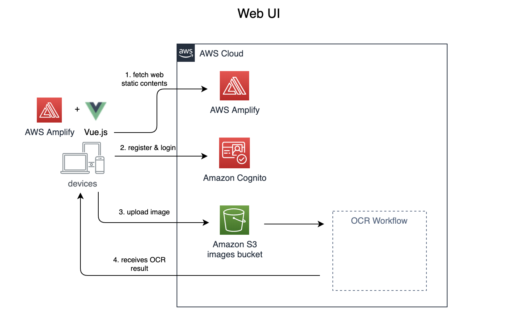

# Web GUI Flow
<br> 

## Setting up a Dev Environment

### Pre-Requisitees

You'll need installed:

* [Node.js](https://nodejs.org/) v10.x or later
* [npm](https://www.npmjs.com/) v5.x or later
* [git](https://git-scm.com/) v2.14.1 or later
* Amplify CLI: `npm install -g @aws-amplify/cli`

You may also wish to globally install the [Vue CLI](https://cli.vuejs.org/), otherwise you'll need to prefix any `vue` commands with `npx`.


###  OLD Instructions: Re-configuring from scratch

#### Configure Amplify CLI with AWS IAM user keys
```sh
amplify configure
```
This creates the following files:
* ~/.aws/config
* ~/.aws/credentials

#### Initialize Amplify
```sh
amplify init
```
* project name: smartocr
* env name: dev
* default editor: Visual Studio Code
* type of app: javascript
* javascript framework: vue
* src dir path: src
* distribution dir path: ist
* build command: npm run-script build
* start command: npm run-script serve
* using default provider: awscloudformation (can’t change)
* AWS profile: use default or new profile

#### Adds S3 storage with Cognito Authentication and Authorization
```sh
amplify add storage
```
* Content (Images, audio, video, etc)
* add auth now: Y
* default authentication and security configuration: Default configuration
* How do you want users to be able to sign in: Username
* Advanced settings: N
* Resource friendly name: smartocr
* bucket name: <b>smartocr-uploads</b>
* who should have access: Auth users only
* access: create/update, read
* add Lambda trigger: N

#### Update cloud resources
Run the following command to check Amplify's status:
```sh
amplify status
```
This will show the current status of the Amplify project, including the current environment, any categories that have been created, and what state those categories are in.

Run the following command to update the cloud resources.
```sh
amplify push
```


## Running the App Locally

```sh
npm run serve
```

If you are running this in an AWS Cloud9 environment, replace following content in the <b>vue.config.js</b> file
```js
    //public: 'http://localhost:8080’
    public: 'https://xxxxxxxxxxxx.vfs.cloud9.us-east-1.amazonaws.com'
```

### Login to app

You may now login to the app on your local machine. On the home page, create an account with a valid email address for email confirmation. Login with the your credentials and try uploading samples from this folder.

### Publish app

```sh
amplify publish
```
Note the published url, e.g. xvxvxvxvxvxvxv.amplifyapp.com

## Cleanup project
```sh
amplify delete
```
These objects must be deleted explicitly
* S3 buckets
